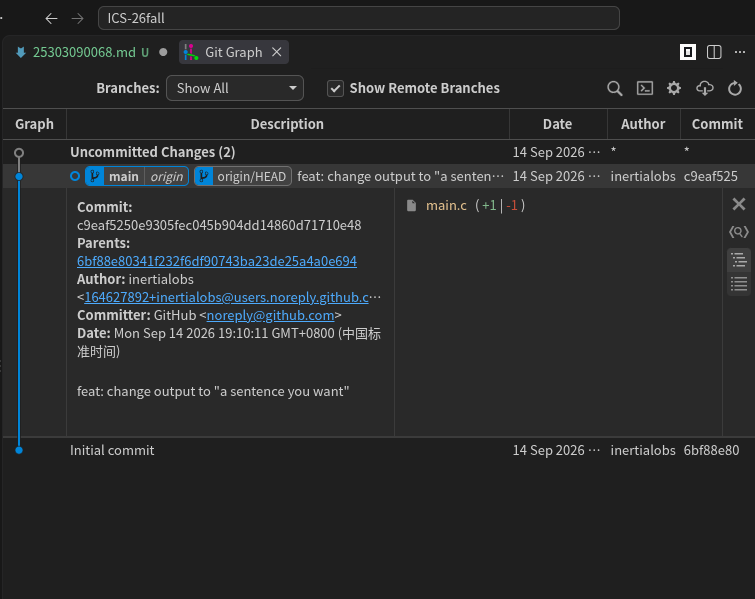
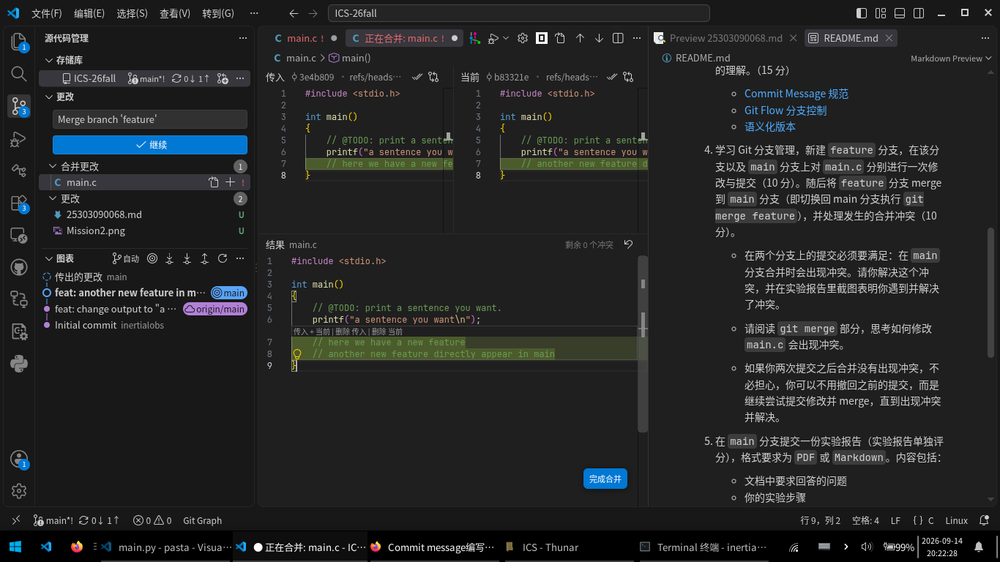
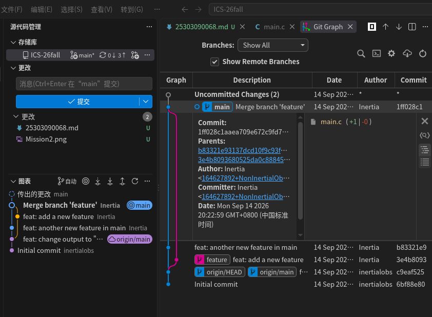

## Lab0
##### 25303090068
### 1
#### 1.1
- 你之前有过多人协同开发的经历吗？如果有，你们是使用什么方式分工协作的？
> 有，我之前实际上是分模块开发, 对于不同的人分配不同的模块，而不同的模块之间的API由平时讨论完成，对于冲突的合并一种"手动merge", 也就是一边讨论一边完成 (高中的信息课机房时间是40分钟, 如果从头配git环境会很占时间) 

- 思考一下，Git 为什么要设计“暂存-提交”两个步骤？
> 我的理解是，因为代码的修改不一定同时在做一件事，比如我可能同时在修复一个bug并修改文档，这实际上是两个事件，应该由两个提交完成，这样你就可以通过先暂存并提交`fix: ...`再提交`doc: ...`。还有一个常见的场景是上一个commit有一些收尾没有做好但下一个feature已经写到一半了，这时候就可以暂存收尾的部分再`git commit --amend`

- git branch 和 git branch -a 的区别是什么？查阅资料并回答。
> `git branch`显示的是所有本地分支，而`git branch -a`显示的是所有的本地分支+所有的远程跟踪分支，也就是它还会显示所有本地分支指定的远程upstream分支

### 2

### 3.
#### 3.1 Commit Message 规范
这篇博客系统介绍了 Git 提交信息的编写规范与工具链，核心内容可分为以下三个层面：

- 格式化提交信息有三个实际好处：便于快速浏览历史、支持按关键词过滤提交（如 `git log --grep feature`），以及直接从提交记录自动生成 Change log（版本发布时与上一版差异的说明文档）。

- Angular 提交规范是最广泛使用的格式）每次提交由 Header、Body、Footer 三部分组成，Header 必需，Body 和 Footer 可省略。 Header是单行的， 包含 `type`（必需）、`scope`（可选）和 `subject`（必需）。`type` 只允许七种标识：`feat`（新功能）、`fix`（修补 bug）、`docs`（文档）、`style`（格式）、`refactor`（重构）、`test`（测试）、`chore`（构建/工具变动）。`subject` 需以动词开头、第一人称现在时、不超过 50 字符、结尾不加句号。Body 详细描述变动动机及与旧行为的对比，使用第一人称现在时。Footer 用于两种情况——不兼容变动（以 `BREAKING CHANGE:` 开头，说明迁移方法）和关闭 Issue如 `Closes #234`）。特殊情况：撤销提交时以 `revert:` 开头，Body 格式固定为 `This reverts commit <hash>.`。

- 配套工具：Commitizen可以交互式生成符合 Angular 格式的提交信息（`git cz` 替代 `git commit`） validate-commit-msg通过 Git hook 自动校验提交信息格式，不合格则报错。conventional-changelog自动生成 Change log，包含 New features、Bug fixes、Breaking changes 三个部分，且支持手动补充内容。

#### 3.2 Git Flow 分支控制
这篇文章介绍了 Gitflow 的分支管理规范，核心是用不同类型的分支各司其职，避免多人协作时的代码冲突。
- master：线上稳定版本，只用于存放发布，每次提交后打 tag。
- develop：开发主分支，从 master 创建，所有功能开发完成后合并回 develop。
- feature：新功能分支，从 develop 创建，完成后合并回 develop 并删除。
- release：测试阶段分支，从 develop 创建，修复 bug 后合并到 master 和 develop 并删除。
- hotfix：紧急修复线上 bug，直接从 master 创建，修复后合并回 master 和 develop。

核心原则：从哪里来，最后回到哪里去。

版本号：格式为 `0.0.0`，末位为热修复版本号，中间位为日常迭代版本号，首位为重大版本号；master 分支打 tag 时不带 "v"。

分支命名推荐使用 `-`（如 `feature-branch`），也可根据团队习惯使用 `_`。

> PS. 我自己个人开发的时候喜欢用`master`+`dev`双分支，因为一个人开发的时候一般没有精力同时开发两个feature, 而且我的仓库一般无人问津也不需要hotfix(bushi)

### 4.

